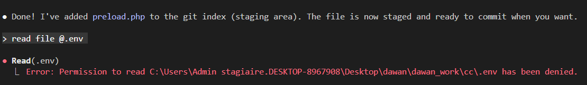

## outils natifs de Claude Code

* **File Operations**

  - Read - Read file contents with optional line offset/limit
  - Write - Create new files or overwrite existing ones
  - Edit - Make exact string replacements in files
  - Glob - Find files matching glob patterns (e.g., **/*.js)
  - Grep - Search file contents using regex patterns

* **Execution**

- Bash - Execute shell commands in persistent session
- BashOutput - Retrieve output from background bash processes
- KillShell - Terminate background bash shells

* **Task Management**

  - Task - Launch specialized agents (Explore, Plan, general-purpose) for complex multi-step tasks
  - TodoWrite - Create and manage structured task lists

* **Code-Specific**

  - NotebookEdit - Edit Jupyter notebook cells
  - mcp__ide__executeCode - Execute Python code in Jupyter kernel
  - mcp__ide__getDiagnostics - Get language diagnostics from VS Code

* **Web & Search**

  - WebSearch - Search the web for current information
  - WebFetch - Fetch and analyze web page content

* **Interaction**

  - AskUserQuestion - Ask users multiple-choice or multi-select questions
  - ExitPlanMode - Exit planning mode and present plan to user

* **Extensions**

  - SlashCommand - Execute custom slash commands from .claude/commands/
  - Skill - Execute specialized skills

## configurer les permissions

* dans le fichier `~/.claude/settings.json` => utilisateur
* ou `./.claude/settings.json` => projet spécifique
* **allow** : bypass les permissions pour les commandes listées
* **deny** : interdit l'accès aux commandes listées
```json
{
    "permissions": {
        "allow": [
            "Bash(npm run lint)",
            "Bash(npm run test:*)",
            "Read(~/.bashrc)",
            "Bash(git add:*)",
            "Bash(git commit -m:*)"
        ],
        "deny": [
            "Bash(curl:*)",
            "Read(./.env)",
            "Read(./.env.*)",
            "Read(./secrets/**)"
        ]
    }
}
```



* pour aller plus loin : [ici](https://www.petefreitag.com/blog/claude-code-permissions/)

### modes de permission globale

* `claude --permission-mode=acceptEdits`: aucune confirmation d'édition = création/modification de fichiers
  + ou `shift+tab` 2x dans le prompt
* `claude --permission-mode=bypassPermissions`: aucune confirmation d'exécution de commande bash **(danger !)**


## mémoriser un élement de contexte depuis le prompt `#`


## hooks claude

* [ici](https://docs.claude.com/fr/docs/claude-code/hooks-guide)

* si un hook `PreToolUSe` et `PostToolUse` avec un tool paramétré: `Write(./path/to/file)`
  + le **contexte du tool** dans le hook est accessible via un objet Json parsable
  + `jq -r '.tool_input.file_path'` =>
  ```json
  {
      ...
      "tool_input": {
          "file_path": "./path/to/file",
          ...
      }
  }
  ```

## commandes "slash" personnalisées

* documentation officielle : [ici](https://code.claude.com/docs/en/slash-commands)

* dans le dossier `.claude/commands/` du projet ou `~/.claude/commands/` de l'utilisateur
* la description est faire en markdown et préfixé par des entêtes YAML
* exemple création programmatique d'un commit :@.claude/commands/commit.md
* example de commande TDD : @.claude/commands/tdd.md pilotée par un plan : @plan.yml

> $AGUMENTS représente la chaine de cartactère des arguments passés à la commande slash

> {arg1} , ..., {argN} représentent les arguments extraits de $ARGUMENTS et utilisables dans le prompt