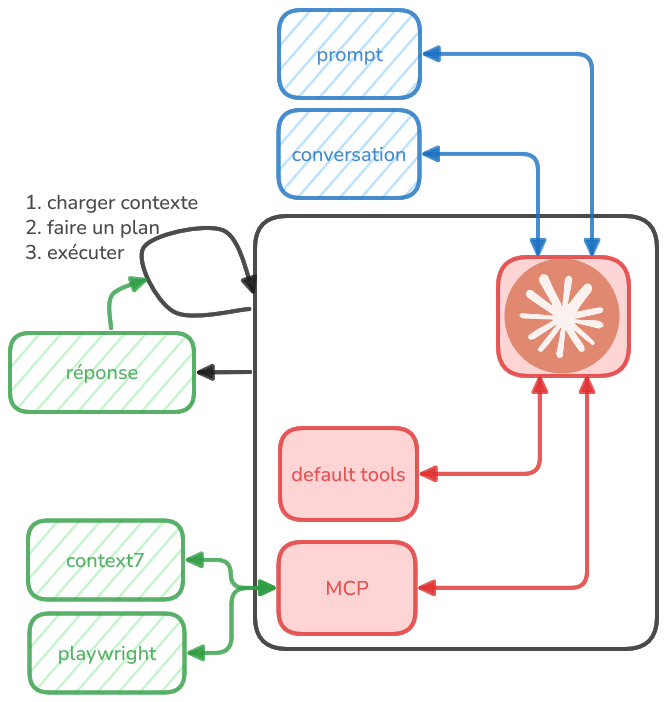

# Claude Code

 * assitant de programmation IA local basé sur Claude 4 de Anthropic
 * sous forme d'une CLI (command line interface)

## conditions d'utilisation

### licence courante Max x5

Max 5x ($100/month)
  - ~225 messages every 5 hours (5x more than Pro) => message = prompt ou réponse
  - 140-280 hours of Sonnet 4 per week
  - 15-35 hours of Opus 4 per week
  - ~88,000 tokens per session 
    + => ~44,000 words , 
    + => ~800 tokens / message 
    => ~100 messages per session 
    => ~12 message / person 
  - Auto-switches from Opus → Sonnet at 20% usage (ou Haiku (SML) ~= petit Sonnet (LLM))
  - Claude Max = Single User Only
    + Each Max subscription is for 1 user only
    + Account sharing is against Anthropic's terms of service

### autres offres

- Education Plan: formulaire + négociation avec Anthropic pour tarifs réduits
  + The educational pricing for institutions is **not publicly listed** and is customized based on:
    - Number of users
    - Duration (semester vs annual contracts)
  + ex: licence gratuite pour l'université Northeastern University pour 13 campus => taille critique

- API access: https://www.anthropic.com/product/api 
  + Tarification basée sur l'utilisation (tokens)    => **très cher!!!!!**
  + Différents modèles avec des coûts variés
  + Idéal pour intégration dans des applications ou services 

- Teams plan:
  - 30$ / utilisateur / mois
  - Collaboration en équipe min 5 utilisateurs
  - négo

- Enterprise Plan:
  - 40$ / utilisateur / mois
  - Solutions personnalisées pour grandes organisations min 20 utilisateurs
  - négo

## installation et chargement de la licence

### installation

1. ajouter node 18+

2. selon vos os: [instructions d'installation Claude Code](https://docs.claude.com/en/docs/claude-code/setup)
   * ajouter ~\.local\bin à votre PATH si nécessaire
3. dans bash ou Git Bash:

* `claude`
* spécifier le thème (dark ou light ...)
* demander la licence Max x5 => URL
* coller la clé de licence
* terminer l'installation
* trust...
* END

* option: ajouter l'extension Claude Code à VS Code pour une meilleure intégration
* ou `/ide vscode` dans Claude Code

> REM: comparatif des coûts entre Claude API et OpenAI API: https://docs.claude.com/en/docs/claude-vs-openai-pricing
> REM:  //                                      Copilot: dépôts github privés + copilot => 14$/mois 12€/mois
> REM:  //            utilisation des données   Copilot: ===> chez Microsoft != pas de données d'entreprise !!! != Antropic moins intrusif

## docs

* chaines youtube:
   - melvynx (FR)
   - net ninja (EN trduit en FR)
  

